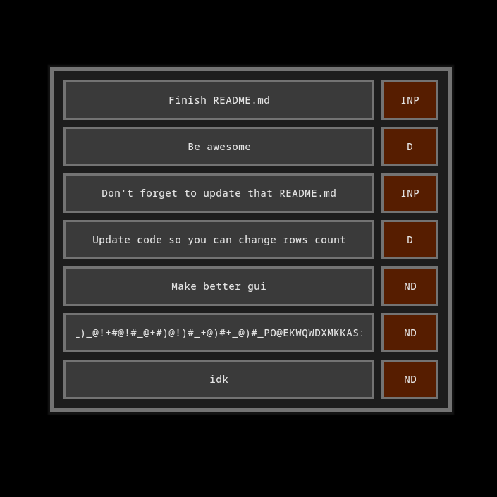

# CTODO — Little program made with [cassete cgui](https://github.com/fraawlen/cassette/blob/trunk/docs/ui-model.md)

### What you can find *here*:

 1. Input handling that supports only latin characters
 2. The way to swap grids (because there is no such an example project in original cassette repository </3)
 3. And other nerdy C array, memory, pointers stuff

### Implemented:
- [x] Changing status
- [x] Deleting ToDo values (Shift + Click on status button)
- [x] Adding new ToDo values
- [x] Renaming (Click on title, Control + Backspace to erase whole text, no way to undo btw :3)
- [x] Saving and loading ToDo values
- [ ] Pages (May never implement it, if you want more than 7 values, feel free to fork this repository and change value of ROWS_COUNT in the limits.h file)

### Statuses
1. ND - Not Done
2. INP - In Progress
3. D - Done

### How to build?
1. Make sure to install [cassette](https://github.com/fraawlen/cassette?tab=readme-ov-file#build) and have libxcb installed.
2. Run `make` in the project folder
3. Run `./ctodo`
4. To clean directory, run `make clean`
